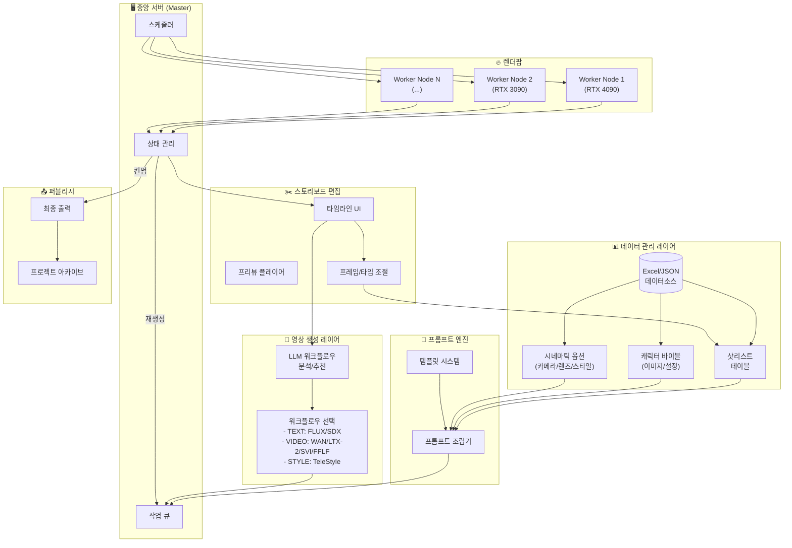
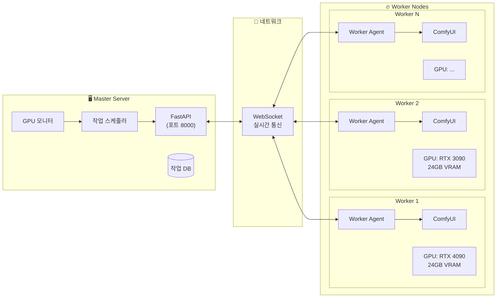
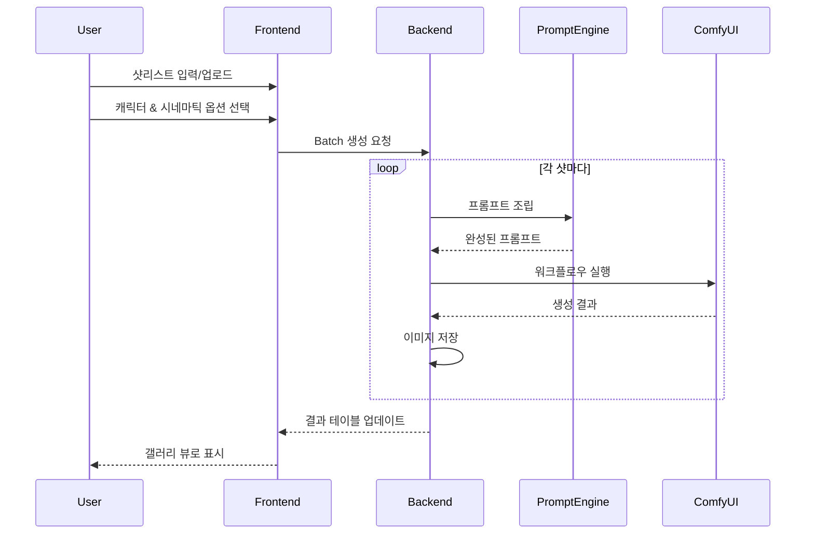
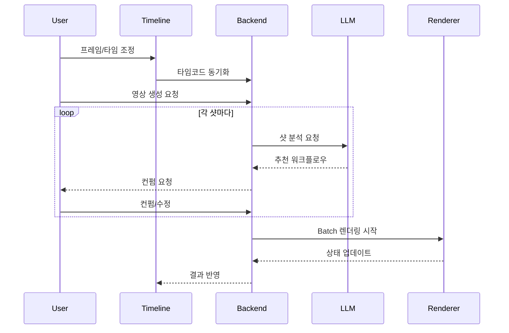

# 🎬 AI Production Pipeline Tool - 구현 계획서

## 개요

Airtable 스타일의 AI 영상 프리프로덕션 파이프라인 도구입니다.  
엑셀/JSON 기반 데이터 관리 → ComfyUI 배치 이미지 생성 → 스토리보드 편집 → 영상 생성 워크플로우를 통합합니다.


---

## User Review Required

> [!IMPORTANT]
> **기술 스택 선택 필요**
> - **프론트엔드**: React + Vite (권장) vs. 순수 HTML/JS
> - **백엔드**: Python FastAPI (권장) vs. Node.js
> - **데이터 저장**: JSON 파일 기반 vs. SQLite

> [!WARNING]
> **ComfyUI 연동**
> - 현재 로컬 ComfyUI 서버 주소가 필요합니다 (기본: `http://127.0.0.1:8188`)
> - 사용 가능한 워크플로우 목록 확인 필요

> [!IMPORTANT]
> **LLM 연동 방식**
> - OpenAI API 사용 여부
> - 로컬 LLM (Ollama 등) 사용 여부

---

## 시스템 아키텍처



---

## 🔥 분산 렌더팜 아키텍처

### 개요

중앙 서버(Master)가 작업을 관리하고, 여러 Worker Node들이 실제 렌더링을 수행하는 구조입니다.
각 Worker의 GPU 상태를 실시간 모니터링하여 최적의 작업 분배를 수행합니다.



### Worker Node 상태 정보

| 필드 | 설명 |
|------|------|
| `node_id` | 고유 식별자 |
| `hostname` | 컴퓨터 이름/IP |
| `gpu_name` | GPU 모델명 (RTX 4090, 3090 등) |
| `gpu_memory_total` | 총 VRAM (GB) |
| `gpu_memory_used` | 사용 중인 VRAM (GB) |
| `gpu_utilization` | GPU 사용률 (%) |
| `status` | idle / busy / offline / error |
| `current_job_id` | 현재 처리 중인 작업 ID |
| `comfy_url` | 해당 노드의 ComfyUI 주소 |
| `capabilities` | 지원 워크플로우 목록 |
| `last_heartbeat` | 마지막 통신 시간 |

### 작업 분배 알고리즘

```python
def assign_job_to_worker(job: Job, workers: List[WorkerNode]) -> WorkerNode:
    """
    작업을 최적의 Worker에 할당
    
    우선순위:
    1. 워크플로우 호환성 확인
    2. VRAM 요구량 충족 여부
    3. GPU 사용률이 가장 낮은 노드
    4. 대기 중인 작업이 가장 적은 노드
    """
    eligible_workers = [
        w for w in workers
        if w.status == 'idle'
        and job.workflow_type in w.capabilities
        and w.gpu_memory_available >= job.vram_required
    ]
    
    if not eligible_workers:
        return None  # 대기열에 추가
    
    # GPU 사용률 기준 정렬
    return min(eligible_workers, key=lambda w: w.gpu_utilization)
```

### 워크플로우별 VRAM 요구량

| 워크플로우 | 최소 VRAM | 권장 VRAM | 비고 |
|-----------|----------|----------|------|
| Text-to-Image (FLUX) | 12GB | 16GB | 기본 이미지 생성 |
| WAN-Animate | 16GB | 24GB | 480p 기준 |
| LTX-2 | 24GB | 48GB | 고해상도 영상 생성 |
| SVI | 16GB | 24GB | 최신 비디오 생성 모델 |
| TeleStyle | 12GB | 16GB | 스타일 트랜스퍼 특화 |
| I2V (KLING/Runway) | 8GB | 12GB | API 기반 |
| FFLF | 20GB | 24GB+ | 고품질 영상 |
| Frame Interpolation | 8GB | 12GB | RIFE 등 |

---

## Proposed Changes

### 1. 프로젝트 구조

프로젝트 경로: `e:\Net\Antigravity_prj\3D_Comfy_RnD\AIPipeline_tool`

```
AIPipeline_tool/
├── master/                     # 중앙 서버 (Master)
│   ├── main.py                 # FastAPI 메인 서버
│   ├── models/
│   │   ├── shot.py             # 샷 데이터 모델
│   │   ├── character.py        # 캐릭터 바이블 모델
│   │   ├── cinematic.py        # 시네마틱 옵션 모델
│   │   ├── job.py              # 작업 모델
│   │   └── worker.py           # Worker 노드 모델
│   ├── services/
│   │   ├── prompt_engine.py    # 프롬프트 조립 엔진
│   │   ├── job_scheduler.py    # 작업 스케줄러
│   │   ├── worker_manager.py   # Worker 노드 관리
│   │   ├── llm_analyzer.py     # LLM 워크플로우 분석
│   │   └── gpu_monitor.py      # GPU 상태 모니터링
│   ├── routers/
│   │   ├── shots.py            # 샷리스트 API
│   │   ├── jobs.py             # 작업 관리 API
│   │   ├── workers.py          # Worker 관리 API
│   │   └── render.py           # 렌더링 API
│   └── websocket/
│       └── ws_handler.py       # WebSocket 통신
│
├── worker/                     # Worker Node 에이전트
│   ├── agent.py                # Worker 에이전트 메인
│   ├── comfy_client.py         # ComfyUI API 클라이언트
│   ├── gpu_reporter.py         # GPU 상태 리포터
│   └── job_executor.py         # 작업 실행기
│
├── frontend/
│   ├── src/
│   │   ├── components/
│   │   │   ├── ShotTable.jsx       # 샷리스트 테이블
│   │   │   ├── CharacterBible.jsx  # 캐릭터 바이블 UI
│   │   │   ├── CinematicOptions.jsx # 시네마틱 옵션 UI
│   │   │   ├── Timeline.jsx        # 타임라인 편집기
│   │   │   ├── WorkerDashboard.jsx # Worker 모니터링 대시보드
│   │   │   ├── JobQueue.jsx        # 작업 큐 UI
│   │   │   └── StatusPanel.jsx     # 상태 관리 패널
│   │   ├── App.jsx
│   │   └── main.jsx
│   └── index.html
│
├── workflows/                  # ComfyUI 워크플로우 JSON들
│   ├── text_to_image/
│   │   ├── flux_basic.json
│   │   ├── flux_lora_mix.json  # LoRA 지원 추가
│   │   └── flux_upscale.json
│   ├── image_to_video/
│   │   ├── wan_animate.json
│   │   ├── ltx2.json           # LTX-2 모델
│   │   ├── svi.json            # SVI 모델
│   │   ├── telestyle.json      # TeleStyle (스타일 전송)
│   │   ├── i2v_kling.json
│   │   └── fflf.json
│   └── video_utils/
│       ├── frame_interpolation.json
│       └── frame_split.json
│
├── projects/                   # 프로젝트별 데이터 저장 (공유 스토리지)
│   └── {project_id}/
│       ├── data.json           # 프로젝트 데이터
│       ├── shots/              # 생성된 샷 이미지들
│       ├── renders/            # 렌더링된 영상들
│       └── temp/               # 임시 파일
│
├── shared_storage/             # Worker들이 접근하는 공유 스토리지 경로
│   └── (NAS 또는 네트워크 드라이브 마운트)
│
└── requirements.txt
```

---

### 2. 데이터 모델

#### [NEW] [shot.py](file:///e:/Net/Antigravity_prj/3D_Comfy_RnD/AIPipeline_tool/backend/models/shot.py)

샷 데이터 모델 - 각 샷의 정보와 상태를 관리

```python
class Shot:
    id: str                    # SHT-00001 형식
    scene_description: str     # 장면 설명
    action: str               # 액션 설명
    character_ids: List[str]  # 연결된 캐릭터들
    cinematic_id: str         # 시네마틱 옵션 연결
    
    # 생성 관련
    generated_prompt: str     # 조립된 프롬프트
    reference_images: List[str]  # 참조 이미지 경로
    generated_image: str      # 생성된 이미지 경로
    
    # 타임라인 관련
    frame_count: int          # 프레임 수
    duration_seconds: float   # 재생 시간
    timecode_in: str         # 시작 타임코드
    timecode_out: str        # 종료 타임코드
    
    # 상태 관리
    # 상태 관리
    status: Enum              # pending | generating | completed | needs_revision | approved
    workflow_type: str        # wan | ltx2 | svi | telestyle | fflf ...
    render_path: str          # 렌더링된 영상 경로
```

#### [NEW] [character.py](file:///e:/Net/Antigravity_prj/3D_Comfy_RnD/AIPipeline_tool/backend/models/character.py)

캐릭터 바이블 모델 - 캐릭터의 일관성 유지를 위한 정보

```python
class Character:
    id: str
    name: str
    description: str          # 외형 설명
    reference_sheet: str      # 참조 이미지 경로
    
    # LoRA 설정
    lora_path: str            # 캐릭터 전용 LoRA 파일 경로 (.safetensors)
    lora_strength: float      # 기본 적용 강도 (0.0 ~ 1.0)
    trigger_words: List[str]  # LoRA 트리거 단어
    
    clothing_options: List[ClothingOption]
    default_clothing: str
    style_keywords: List[str] # 스타일 키워드
```

#### [NEW] [cinematic.py](file:///e:/Net/Antigravity_prj/3D_Comfy_RnD/AIPipeline_tool/backend/models/cinematic.py)

시네마틱 옵션 모델 - 카메라, 렌즈, 스타일 등

```python
class CinematicOption:
    id: str
    name: str
    
    # 카메라 설정
    camera_body: str          # Arri Alexa, Sony FX6 등
    focal_length: str         # 35mm, 50mm 등
    lens_type: str            # Anamorphic, Vintage 등
    
    # 시각 스타일
    film_stock: str           # 필름 에뮬레이션
    style: str               # Photorealistic, Anime 등
    look_and_feel: str       # Dune, Blade Runner 등
    
    # 조명
    lighting_source: str     # Natural, Neon 등
    lighting_style: str      # Rembrandt, High Key 등
    
    # 분위기
    environment: str         # 환경 설명
    atmosphere: str          # Mood
    filter: str              # 렌즈 필터
    aspect_ratio: str        # 16:9, 2.39:1 등
```

---

### 3. 핵심 기능 구현

#### [NEW] [prompt_engine.py](file:///e:/Net/Antigravity_prj/3D_Comfy_RnD/AIPipeline_tool/backend/services/prompt_engine.py)

Airtable CONCATENATE 수식을 Python으로 구현

```python
def assemble_prompt(shot: Shot, character: Character, cinematic: CinematicOption) -> str:
    """
    프롬프트 조립 공식:
    Style + Subject + Action + Environment + Camera + Lens + Film + Lighting + Atmosphere + Filter + Ratio
    """
    parts = []
    
    # 스타일
    if cinematic.style:
        parts.append(f"A {cinematic.style} image of")
    
    # 주체 & 액션
    parts.append(f"{character.description}, {shot.action}")
    
    # 환경
    if cinematic.environment:
        parts.append(f"set in {cinematic.environment}")
    
    # 카메라
    if cinematic.camera_body:
        parts.append(f"Captured with a {cinematic.camera_body}")
    
    # ... 나머지 요소들
    
    # LoRA 트리거 워드 자동 추가 (캐릭터 LoRA가 활성화된 경우)
    if character.trigger_words:
        parts.append(", ".join(character.trigger_words))
    
    return ", ".join(parts)
```

---

## 핵심 워크플로우

### 워크플로우 1: 이미지 생성 Batch



### 워크플로우 2: 편집 → 영상 생성



---

## UI 설계

### 메인 대시보드

| 영역 | 기능 |
|------|------|
| **샷 테이블** | Airtable 스타일 테이블, 드래그앤드롭 정렬 |
| **캐릭터 패널** | 캐릭터 카드, 참조 이미지 관리 |
| **시네마틱 패널** | 드롭다운으로 카메라/렌즈/스타일 선택 |
| **타임라인** | 프레임 기반 편집, 드래그로 길이 조절 |
| **프리뷰** | 스토리보드 영상 미리보기 |
| **상태 패널** | 작업 큐, 진행률, 컨펌 버튼 |

---

## Verification Plan

### Automated Tests

```bash
# 백엔드 테스트
pytest backend/tests/

# 프롬프트 조립 테스트
python -m pytest backend/tests/test_prompt_engine.py -v

# ComfyUI 연결 테스트
python backend/services/comfy_client.py --test
```

### Manual Verification

1. **데이터 입출력**: Excel 파일 → 테이블 로드 → 수정 → 저장
2. **프롬프트 조립**: 시네마틱 옵션 변경 → 프롬프트 자동 업데이트 확인
3. **이미지 생성**: 단일 샷 생성 → Batch 생성 → 결과 확인
4. **타임라인 편집**: 프레임 조절 → 데이터베이스 동기화 확인
5. **영상 생성**: LLM 추천 → 컨펌 → 렌더링 → 상태 변경 확인

---

## 개발 우선순위

| Phase | 기능 | 예상 시간 | 우선순위 |
|-------|------|----------|----------|
| Phase 1 | 데이터 모델 & API 기본 구조 | 2-3시간 | ⭐⭐⭐ |
| Phase 2 | 샷 테이블 UI & 프롬프트 엔진 | 3-4시간 | ⭐⭐⭐ |
| Phase 3 | ComfyUI 연동 & 단일 노드 생성 | 2-3시간 | ⭐⭐⭐ |
| Phase 4 | **렌더팜 기본 구조** | 3-4시간 | ⭐⭐⭐ |
| Phase 5 | **Worker 에이전트 & GPU 모니터링** | 2-3시간 | ⭐⭐⭐ |
| Phase 6 | **작업 스케줄러 & 분배** | 2-3시간 | ⭐⭐ |
| Phase 7 | 타임라인 편집 UI | 3-4시간 | ⭐⭐ |
| Phase 8 | LLM 워크플로우 분석 | 2-3시간 | ⭐⭐ |
| Phase 9 | 상태 관리 & 퍼블리시 | 2-3시간 | ⭐ |

---

## 렌더팜 배포 가이드

### Master 서버 실행

```bash
# Master 서버 (중앙 관리)
cd master
pip install -r requirements.txt
uvicorn main:app --host 0.0.0.0 --port 8000
```

### Worker 노드 실행

```bash
# 각 Worker 컴퓨터에서
cd worker
pip install -r requirements.txt

# Master 서버 주소 지정
python agent.py --master http://192.168.1.100:8000 --comfy http://127.0.0.1:8188
```

### 공유 스토리지 설정

> [!IMPORTANT]
> 모든 노드가 동일한 프로젝트 파일에 접근할 수 있도록 NAS 또는 네트워크 드라이브 설정 필요

```bash
# Windows: 네트워크 드라이브 매핑
net use Z: \\NAS_SERVER\projects /persistent:yes

# Linux: NFS 마운트
sudo mount -t nfs nas_server:/projects /mnt/projects
```

---

## 결정된 사항 (승인됨)

- ✅ **기술 스택**: React + FastAPI
- ✅ **ComfyUI**: 각 Worker 노드 로컬 (`127.0.0.1:8188`)
- ✅ **LLM**: OpenAI API (Ollama 추후 지원)
- ✅ **개발 방식**: 핵심 기능 우선 (Phase 1-6 집중)
- ✅ **렌더팜**: 분산 처리 지원 (Master-Worker 구조)
